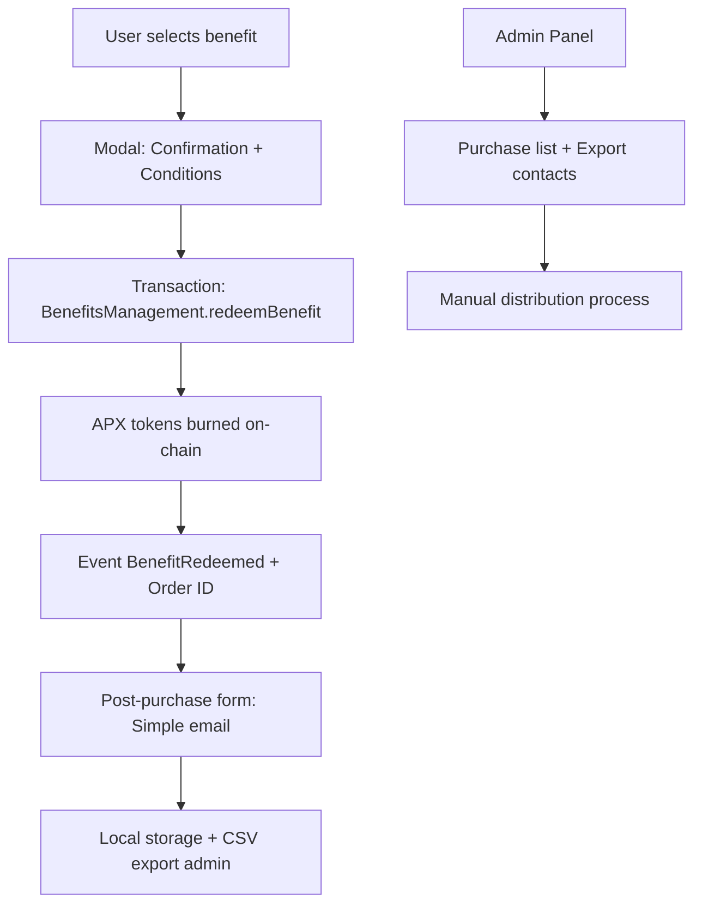

# 🎁 Benefits System Architecture

## Overview

The Benefits system allows users to exchange their APX tokens for real benefits. Simplified architecture with Smart Contract + post-purchase email collection.

## 🏗️ Global Architecture



## 📋 Smart Contract BenefitsManagement

### Data Structure

```solidity
// SPDX-License-Identifier: MIT
pragma solidity ^0.8.0;

import "@openzeppelin/contracts/token/ERC20/IERC20.sol";
import "@openzeppelin/contracts/access/Ownable.sol";
import "@openzeppelin/contracts/security/ReentrancyGuard.sol";

contract BenefitsManagement is Ownable, ReentrancyGuard {
    IERC20 public immutable apxToken;
    
    struct Benefit {
        uint256 priceAPX;           // Price in APX (in wei)
        string title;               // Benefit title
        string description;         // Short description
        string mechanics;           // Mechanics (1 line)
        string guardrails;          // Guardrails (limits, deadlines)
        string tokenomics;          // Tokenomics badge (100% burn, gasless)
        bool isActive;              // Active/inactive
        uint256 totalRedeemed;      // Total number of redemptions
        uint256 maxRedemptions;     // Global limit (0 = unlimited)
    }
    
    struct Redemption {
        address user;
        bytes32 benefitId;
        uint256 apxBurned;
        uint256 timestamp;
        string orderId;
        bytes32 contactHash;        // Simple hash for email link
        bool isProcessed;
    }
    
    // Benefits mapping
    mapping(bytes32 => Benefit) public benefits;
    
    // User redemptions mapping
    mapping(address => mapping(bytes32 => bool)) public userRedeemed;
    
    // Redemption history
    mapping(string => Redemption) public redemptions;
    
    // Active benefits list
    bytes32[] public activeBenefitIds;
    
    // Events
    event BenefitCreated(bytes32 indexed benefitId, uint256 priceAPX, string title);
    event BenefitRedeemed(address indexed user, bytes32 indexed benefitId, uint256 apxBurned, string orderId);
    event BenefitProcessed(string indexed orderId, address indexed admin);
    event ContactSubmitted(string indexed orderId, bytes32 contactHash);
}
```

### Main Functions

```solidity
/**
 * @dev Create a new benefit (admin only)
 */
function createBenefit(
    bytes32 benefitId,
    uint256 priceAPX,
    string memory title,
    string memory description,
    string memory mechanics,
    string memory guardrails,
    string memory tokenomics,
    uint256 maxRedemptions
) external onlyOwner

/**
 * @dev Redeem a benefit (burn APX + generate Order ID)
 */
function redeemBenefit(bytes32 benefitId) external nonReentrant returns (string memory orderId)

/**
 * @dev Submit contact hash (called after email collection)
 */
function submitContactHash(string memory orderId, bytes32 contactHash) external

/**
 * @dev Mark a redemption as processed (admin only)
 */
function markAsProcessed(string memory orderId) external onlyOwner
```

## 🎨 Frontend Integration

### TypeScript Types

```typescript
// Types for benefits
export interface Benefit {
  id: string
  title: string
  description: string // Value proposition
  mechanics: string // Mechanics in 1 line
  guardrails: string // Guardrails and limits
  tokenomics: string // Tokenomics badge
  priceAPX: string // Price formatted in APX
  icon: string // Lucide icon name
  color: string // Card color
  isActive: boolean
  totalRedeemed: number
  maxRedemptions: number
  canRedeem: boolean // Calculated client-side
  isRedeemed: boolean // If user already purchased it
}

// Types for redemptions
export interface BenefitRedemption {
  orderId: string
  benefitId: string
  benefitTitle: string
  apxBurned: string
  timestamp: Date
  txHash: string
  isProcessed: boolean
  contactSubmitted: boolean
}

// Types for contact collection
export interface BenefitContact {
  orderId: string
  email: string
  benefitTitle: string
  timestamp: Date
  status: 'submitted' | 'processing' | 'fulfilled'
}
```

### Predefined Benefits

```typescript
export const PREDEFINED_BENEFITS = {
  CREATOR_1ON1: {
    id: '0x316f6e31000000000000000000000000000000000000000000000000000000', // "1on1"
    title: '1:1 with the Creator (Aiden P2P)',
    description: 'A 30–45 min private session to discuss product, token design, Base integration, or GTM.',
    mechanics: 'Redeem with APX → on-chain receipt → booking link sent.',
    guardrails: 'Limit: 1 per wallet, expires in 30 days',
    tokenomics: '100% burn',
    priceAPX: '5000',
    icon: 'UserCheck',
    color: 'bg-gradient-to-r from-purple-500 to-pink-500',
    maxRedemptions: 10
  },
  
  BETA_ACCESS: {
    id: '0x6265746161636365737300000000000000000000000000000000000000000000', // "betaaccess"
    title: 'Early Access to the Beta',
    description: 'Priority access to the next product release.',
    mechanics: 'Redeem with APX → allowlist your wallet for Beta features.',
    guardrails: 'Limit: 1 per wallet, permanent access',
    tokenomics: '100% burn + gasless',
    priceAPX: '1000',
    icon: 'Zap',
    color: 'bg-gradient-to-r from-blue-500 to-cyan-500',
    maxRedemptions: 100
  },
  
  USDC_VOUCHER: {
    id: '0x757364637663686572000000000000000000000000000000000000000000000', // "usdcvcher"
    title: '10 USDC Voucher',
    description: 'A 10 USDC credit delivered to your wallet.',
    mechanics: 'Redeem with APX → on-chain event → USDC payout (server-fulfilled) within 24–48h.',
    guardrails: 'Limit: 1 per wallet, payout within 48h',
    tokenomics: '100% burn + gasless',
    priceAPX: '2000',
    icon: 'DollarSign',
    color: 'bg-gradient-to-r from-green-500 to-emerald-500',
    maxRedemptions: 50
  },
  
  LUCKY_DRAW: {
    id: '0x6c75636b796472617700000000000000000000000000000000000000000000', // "luckydraw"
    title: 'Lucky Draw — Win 100 USDC',
    description: 'Entry into a raffle for 100 USDC.',
    mechanics: 'Redeem with APX → on-chain entry logged; transparent draw (tx hash / VRF if added).',
    guardrails: 'Limit: 1 per wallet, draw monthly',
    tokenomics: '100% burn + gasless',
    priceAPX: '500',
    icon: 'Gift',
    color: 'bg-gradient-to-r from-yellow-500 to-orange-500',
    maxRedemptions: 0 // Unlimited
  }
} as const
```

## 📱 UI Components

### BenefitCard Component

```typescript
interface BenefitCardProps {
benefit: Benefit
onRedeem: (benefitId: string) => void
}

export function BenefitCard({ benefit, onRedeem }: BenefitCardProps) {
// Display with:
// - Icon + background color
// - Title + value proposition
// - Mechanics in 1 line
// - Guardrails badge
// - Tokenomics badge
// - Price in APX
// - "Redeem" button or state (Redeemed, Unavailable)
}
```

### PostRedemptionModal Component

```typescript
interface PostRedemptionModalProps {
orderId: string
benefitTitle: string
isOpen: boolean
onSubmit: (email: string) => void
onClose: () => void
}

export function PostRedemptionModal({ orderId, benefitTitle, isOpen, onSubmit, onClose }: PostRedemptionModalProps) {
// Simple modal after purchase with:
// - Confirmation message
// - Email field
// - Explanatory text for manual process
// - Link to Terms
}
```

## 🔗 Integration Points

### React Hooks

```typescript
// Main hook for benefits
export function useBenefitsManagement() {
const getAvailableBenefits = useCallback(async (): Promise<Benefit[]> => {}
const redeemBenefit = useCallback(async (benefitId: string): Promise<{ orderId: string; txHash: string }> => {}
const submitContactInfo = useCallback(async (orderId: string, email: string): Promise<void> => {}
const getUserRedemptions = useCallback(async (): Promise<BenefitRedemption[]> => {}

return {
getAvailableBenefits,
redeemBenefit,
submitContactInfo,
getUserRedemptions,
isLoading,
error
}
}

// Admin hook for management
export function useBenefitsAdmin() {
const createBenefit = useCallback(async (benefitData: CreateBenefitData) => {}
const getAllRedemptions = useCallback(async (): Promise<BenefitRedemption[]> => {}
const markAsProcessed = useCallback(async (orderId: string) => {}
const exportContacts = useCallback(async (): Promise<BenefitContact[]> => {}
}
```

### Local Storage for Contacts

```typescript
// Contact storage service
export class BenefitContactStorage {
private static readonly STORAGE_KEY = 'benefit_contacts'

static save(contact: BenefitContact): void {
const contacts = this.getAll()
contacts.push(contact)
localStorage.setItem(this.STORAGE_KEY, JSON.stringify(contacts))
}

static getAll(): BenefitContact[] {
const stored = localStorage.getItem(this.STORAGE_KEY)
return stored ? JSON.parse(stored) : []
}

static exportCSV(): string {
const contacts = this.getAll()
return convertToCSV(contacts)
}
}
```

## 📊 Admin Interface

### Admin dashboard

- **Overview**: Total redemptions, APX burned revenue, active benefits
- **Redemption list**: OrderID, User, Benefit, Date, Status, Contact
- **CSV Export**: Contacts for manual process
- **Benefits management**: Enable/disable, modify price, create new ones

## 🔧 Configuration and Deployment

### Environment variables

```env
VITE_BENEFITS_CONTRACT_ADDRESS=0x...
VITE_PAYMASTER_URL=https://paymaster.base.org
VITE_CONTACT_ENCRYPTION_KEY=...
```

### Contract configuration

```typescript
export const BENEFITS_MANAGEMENT_CONFIG = {
contractAddress: '0x...' as Address,
abi: BenefitsManagementABI,
adminWallet: '0xF35EeFB35B13d908497BF51Fbc3f0f798f9f93f4' as Address
}
```

## 🚀 Complete User Flow

1. **Discovery**: User visits "My Benefits" section
2. **Selection**: Chooses a benefit and reads details
3. **Confirmation**: Modal with conditions and APX price
4. **Transaction**: Burn APX + receive Order ID on-chain
5. **Contact**: Simple form for email (post-transaction)
6. **Confirmation**: On-chain receipt + Order ID in history
7. **Process**: Team contacts via email for distribution

## 📝 Next Steps

1. Implement the BenefitsManagement Smart Contract
2. Create React hooks and UI components
3. Integrate with Coinbase Paymaster for gasless
4. Test the complete flow
5. Deploy and configure initial benefits

## 🔒 Security and Compliance

- **Rate limiting**: 1 redemption per benefit per wallet
- **Validation**: APX balance verification before transaction
- **Encryption**: Simple hash for contact/redemption link
- **GDPR**: Local storage + CSV export (no centralized database)
- **Audit**: On-chain events for complete traceability
