# 🎁 Benefits System Architecture

## Vue d'ensemble

Le système de Benefits permet aux utilisateurs d'échanger leurs tokens APX contre des bénéfices réels. Architecture simplifiée avec Smart Contract + collecte email post-achat.

## 🏗️ Architecture Globale

```mermaid
graph TD
    A[User sélectionne bénéfice] --> B[Modal: Confirmation + Conditions]
    B --> C[Transaction: BenefitsManagement.redeemBenefit]
    C --> D[APX tokens burned on-chain]
    D --> E[Event BenefitRedeemed + Order ID]
    E --> F[Formulaire post-achat: Email simple]
    F --> G[Storage local + CSV export admin]
    
    H[Admin Panel] --> I[Liste achats + Export contacts]
    I --> J[Process manual de distribution]
```



## 📋 Smart Contract BenefitsManagement

### Structure des données

```solidity
// SPDX-License-Identifier: MIT
pragma solidity ^0.8.0;

import "@openzeppelin/contracts/token/ERC20/IERC20.sol";
import "@openzeppelin/contracts/access/Ownable.sol";
import "@openzeppelin/contracts/security/ReentrancyGuard.sol";

contract BenefitsManagement is Ownable, ReentrancyGuard {
    IERC20 public immutable apxToken;
    
    struct Benefit {
        uint256 priceAPX;           // Prix en APX (en wei)
        string title;               // Titre du bénéfice
        string description;         // Description courte
        string mechanics;           // Mécanique (1 ligne)
        string guardrails;          // Garde-fous (limites, délais)
        string tokenomics;          // Badge tokenomics (100% burn, gasless)
        bool isActive;              // Actif/inactif
        uint256 totalRedeemed;      // Nombre total de rachats
        uint256 maxRedemptions;     // Limite globale (0 = illimité)
    }
    
    struct Redemption {
        address user;
        bytes32 benefitId;
        uint256 apxBurned;
        uint256 timestamp;
        string orderId;
        bytes32 contactHash;        // Hash simple pour lien email
        bool isProcessed;
    }
    
    // Mapping des bénéfices
    mapping(bytes32 => Benefit) public benefits;
    
    // Mapping des rachats par utilisateur
    mapping(address => mapping(bytes32 => bool)) public userRedeemed;
    
    // Historique des rachats
    mapping(string => Redemption) public redemptions;
    
    // Liste des bénéfices actifs
    bytes32[] public activeBenefitIds;
    
    // Events
    event BenefitCreated(bytes32 indexed benefitId, uint256 priceAPX, string title);
    event BenefitRedeemed(address indexed user, bytes32 indexed benefitId, uint256 apxBurned, string orderId);
    event BenefitProcessed(string indexed orderId, address indexed admin);
    event ContactSubmitted(string indexed orderId, bytes32 contactHash);
}
```

### Fonctions principales

```solidity
/**
 * @dev Créer un nouveau bénéfice (admin only)
 */
function createBenefit(
    bytes32 benefitId,
    uint256 priceAPX,
    string memory title,
    string memory description,
    string memory mechanics,
    string memory guardrails,
    string memory tokenomics,
    uint256 maxRedemptions
) external onlyOwner

/**
 * @dev Racheter un bénéfice (burn APX + générer Order ID)
 */
function redeemBenefit(bytes32 benefitId) external nonReentrant returns (string memory orderId)

/**
 * @dev Soumettre le hash de contact (appelé après collecte email)
 */
function submitContactHash(string memory orderId, bytes32 contactHash) external

/**
 * @dev Marquer un rachat comme traité (admin only)
 */
function markAsProcessed(string memory orderId) external onlyOwner
```

## 🎨 Frontend Integration

### Types TypeScript

```typescript
// Types pour les bénéfices
export interface Benefit {
  id: string
  title: string
  description: string // Phrase de valeur
  mechanics: string // Mécanique en 1 ligne
  guardrails: string // Garde-fous et limites
  tokenomics: string // Badge tokenomics
  priceAPX: string // Prix formaté en APX
  icon: string // Nom de l'icône Lucide
  color: string // Couleur de la carte
  isActive: boolean
  totalRedeemed: number
  maxRedemptions: number
  canRedeem: boolean // Calculé côté client
  isRedeemed: boolean // Si l'utilisateur l'a déjà acheté
}

// Types pour les rachats
export interface BenefitRedemption {
  orderId: string
  benefitId: string
  benefitTitle: string
  apxBurned: string
  timestamp: Date
  txHash: string
  isProcessed: boolean
  contactSubmitted: boolean
}

// Types pour la collecte de contact
export interface BenefitContact {
  orderId: string
  email: string
  benefitTitle: string
  timestamp: Date
  status: 'submitted' | 'processing' | 'fulfilled'
}
```

### Bénéfices Prédéfinis

```typescript
export const PREDEFINED_BENEFITS = {
  CREATOR_1ON1: {
    id: '0x316f6e31000000000000000000000000000000000000000000000000000000', // "1on1"
    title: '1:1 with the Creator (Aiden P2P)',
    description: 'A 30–45 min private session to discuss product, token design, Base integration, or GTM.',
    mechanics: 'Redeem with APX → on-chain receipt → booking link sent.',
    guardrails: 'Limit: 1 per wallet, expires in 30 days',
    tokenomics: '100% burn',
    priceAPX: '5000',
    icon: 'UserCheck',
    color: 'bg-gradient-to-r from-purple-500 to-pink-500',
    maxRedemptions: 10
  },
  
  BETA_ACCESS: {
    id: '0x6265746161636365737300000000000000000000000000000000000000000000', // "betaaccess"
    title: 'Early Access to the Beta',
    description: 'Priority access to the next product release.',
    mechanics: 'Redeem with APX → allowlist your wallet for Beta features.',
    guardrails: 'Limit: 1 per wallet, permanent access',
    tokenomics: '100% burn + gasless',
    priceAPX: '1000',
    icon: 'Zap',
    color: 'bg-gradient-to-r from-blue-500 to-cyan-500',
    maxRedemptions: 100
  },
  
  USDC_VOUCHER: {
    id: '0x757364637663686572000000000000000000000000000000000000000000000', // "usdcvcher"
    title: '10 USDC Voucher',
    description: 'A 10 USDC credit delivered to your wallet.',
    mechanics: 'Redeem with APX → on-chain event → USDC payout (server-fulfilled) within 24–48h.',
    guardrails: 'Limit: 1 per wallet, payout within 48h',
    tokenomics: '100% burn + gasless',
    priceAPX: '2000',
    icon: 'DollarSign',
    color: 'bg-gradient-to-r from-green-500 to-emerald-500',
    maxRedemptions: 50
  },
  
  LUCKY_DRAW: {
    id: '0x6c75636b796472617700000000000000000000000000000000000000000000', // "luckydraw"
    title: 'Lucky Draw — Win 100 USDC',
    description: 'Entry into a raffle for 100 USDC.',
    mechanics: 'Redeem with APX → on-chain entry logged; transparent draw (tx hash / VRF if added).',
    guardrails: 'Limit: 1 per wallet, draw monthly',
    tokenomics: '100% burn + gasless',
    priceAPX: '500',
    icon: 'Gift',
    color: 'bg-gradient-to-r from-yellow-500 to-orange-500',
    maxRedemptions: 0 // Illimité
  }
} as const
```

## 📱 Composants UI

### BenefitCard Component

```typescript
interface BenefitCardProps {
  benefit: Benefit
  onRedeem: (benefitId: string) => void
}

export function BenefitCard({ benefit, onRedeem }: BenefitCardProps) {
  // Affichage avec:
  // - Icône + couleur de fond
  // - Titre + phrase de valeur
  // - Mécanique en 1 ligne
  // - Badge garde-fous
  // - Badge tokenomics
  // - Prix en APX
  // - Bouton "Redeem" ou état (Redeemed, Unavailable)
}
```

### PostRedemptionModal Component

```typescript
interface PostRedemptionModalProps {
  orderId: string
  benefitTitle: string
  isOpen: boolean
  onSubmit: (email: string) => void
  onClose: () => void
}

export function PostRedemptionModal({ orderId, benefitTitle, isOpen, onSubmit, onClose }: PostRedemptionModalProps) {
  // Modal simple après achat avec:
  // - Message de confirmation
  // - Champ email
  // - Texte explicatif du process manuel
  // - Lien vers Terms
}
```

## 🔗 Integration Points

### Hooks React

```typescript
// Hook principal pour les bénéfices
export function useBenefitsManagement() {
  const getAvailableBenefits = useCallback(async (): Promise<Benefit[]> => {}
  const redeemBenefit = useCallback(async (benefitId: string): Promise<{ orderId: string; txHash: string }> => {}
  const submitContactInfo = useCallback(async (orderId: string, email: string): Promise<void> => {}
  const getUserRedemptions = useCallback(async (): Promise<BenefitRedemption[]> => {}
  
  return {
    getAvailableBenefits,
    redeemBenefit,
    submitContactInfo,
    getUserRedemptions,
    isLoading,
    error
  }
}

// Hook admin pour gestion
export function useBenefitsAdmin() {
  const createBenefit = useCallback(async (benefitData: CreateBenefitData) => {}
  const getAllRedemptions = useCallback(async (): Promise<BenefitRedemption[]> => {}
  const markAsProcessed = useCallback(async (orderId: string) => {}
  const exportContacts = useCallback(async (): Promise<BenefitContact[]> => {}
}
```

### Storage Local pour Contacts

```typescript
// Service de stockage des contacts
export class BenefitContactStorage {
  private static readonly STORAGE_KEY = 'benefit_contacts'
  
  static save(contact: BenefitContact): void {
    const contacts = this.getAll()
    contacts.push(contact)
    localStorage.setItem(this.STORAGE_KEY, JSON.stringify(contacts))
  }
  
  static getAll(): BenefitContact[] {
    const stored = localStorage.getItem(this.STORAGE_KEY)
    return stored ? JSON.parse(stored) : []
  }
  
  static exportCSV(): string {
    const contacts = this.getAll()
    return convertToCSV(contacts)
  }
}
```

## 📊 Admin Interface

### Tableau de bord admin

- **Vue d'ensemble** : Total rachats, revenus APX burned, bénéfices actifs
- **Liste des rachats** : OrderID, User, Bénéfice, Date, Status, Contact
- **Export CSV** : Contacts pour process manuel
- **Gestion bénéfices** : Activer/désactiver, modifier prix, créer nouveaux

## 🔧 Configuration et Déploiement

### Variables d'environnement

```env
VITE_BENEFITS_CONTRACT_ADDRESS=0x...
VITE_PAYMASTER_URL=https://paymaster.base.org
VITE_CONTACT_ENCRYPTION_KEY=...
```

### Configuration du contract

```typescript
export const BENEFITS_MANAGEMENT_CONFIG = {
  contractAddress: '0x...' as Address,
  abi: BenefitsManagementABI,
  adminWallet: '0xF35EeFB35B13d908497BF51Fbc3f0f798f9f93f4' as Address
}
```

## 🚀 Flow Utilisateur Complet

1. **Découverte** : Utilisateur visite section "My Benefits"
2. **Sélection** : Choisit un bénéfice et lit les détails
3. **Confirmation** : Modal avec conditions et prix APX
4. **Transaction** : Burn APX + réception Order ID on-chain
5. **Contact** : Formulaire simple pour email (post-transaction)
6. **Confirmation** : Reçu on-chain + Order ID dans l'historique
7. **Process** : Équipe contacte via email pour distribution

## 📝 Next Steps

1. Implémenter le Smart Contract BenefitsManagement
2. Créer les hooks React et composants UI
3. Intégrer avec Paymaster Coinbase pour gasless
4. Tester le flow complet
5. Déployer et configurer les bénéfices initiaux

## 🔒 Sécurité et Conformité

- **Rate limiting** : 1 rachat par bénéfice par wallet
- **Validation** : Vérification solde APX avant transaction
- **Encryption** : Hash simple pour lien contact/rachat
- **RGPD** : Stockage local + export CSV (pas de base centralisée)
- **Audit** : Events on-chain pour traçabilité complète
