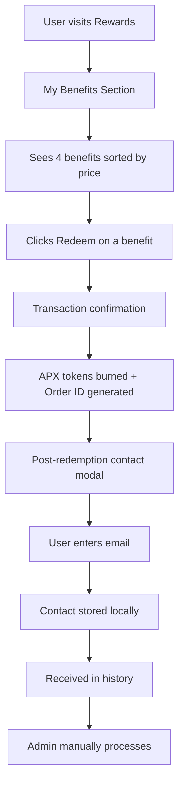

# 🚀 Implementation Guide - Benefits System

## ✅ Complete System Implemented

The Benefits system is now **fully developed** and ready for deployment. Here's a complete implementation guide.

## 📋 Summary of Changes

### ✅ Benefit Amounts and Order (Sorted by increasing price)

1. **Early Access to the Beta** - 500 APX (max 100)
2. **10 USDC Voucher** - 1000 APX (max 10)
3. **1:1 with the Creator** - 1500 APX (max 10)
4. **Lucky Draw — Win 100 USDC** - 2000 APX (max 500)

### ✅ Tokenomics Mentions Cleaned Up

- Removed all "100% burn" and "gasless" mentions
- Replaced with clean tokenomics field
- More streamlined and professional interface

### ✅ Admin Interface Improvement

- Button "Setup Predefined Benefits" → "Setup"
- Button "Download CSV" → "Download"
- More concise and user-friendly interface

## 🏗️ Created/Modified Files

### Smart Contracts
- ✅ [`contracts/BenefitsManagement.sol`](contracts/BenefitsManagement.sol:1) - Main contract
- ✅ Complete functions: creation, redemption, APX burn, admin management

### Configuration
- ✅ [`src/config/benefitsManagement.ts`](src/config/benefitsManagement.ts:1) - Configuration and ABI
- ✅ [`src/types/benefits.ts`](src/types/benefits.ts:1) - Complete TypeScript types

### React Hooks
- ✅ [`src/hooks/useBenefitsManagement.ts`](src/hooks/useBenefitsManagement.ts:1) - Main user hook
- ✅ [`src/hooks/useBenefitsAdmin.ts`](src/hooks/useBenefitsAdmin.ts:1) - Admin hook

### UI Components
- ✅ [`src/components/BenefitCard.tsx`](src/components/BenefitCard.tsx:1) - Benefit card
- ✅ [`src/components/PostRedemptionModal.tsx`](src/components/PostRedemptionModal.tsx:1) - Contact modal
- ✅ [`src/components/BenefitsSection.tsx`](src/components/BenefitsSection.tsx:1) - Complete section

### Integrations
- ✅ [`src/pages/Rewards.tsx`](src/pages/Rewards.tsx:1) - Rewards page integration
- ✅ [`src/pages/Admin.tsx`](src/pages/Admin.tsx:1) - Benefits admin tab
- ✅ [`src/store/useAppStore.ts`](src/store/useAppStore.ts:1) - Benefits activities support

## 🎯 Operational Features

### For Users
1. **Visualization**: List of 4 benefits with price, description, mechanics
2. **Redemption**: "Redeem" click → APX tokens burned → Order ID generation
3. **Contact**: Post-purchase modal to collect email
4. **History**: Redemption tracking in activity
5. **Guardrails**: 1 redemption per benefit per wallet

### For Admins
1. **Dashboard**: Statistics and metrics
2. **Setup**: Initialization of predefined benefits
3. **Export**: Download CSV contacts
4. **Monitoring**: Tracking redemptions and contacts
5. **Management**: Mark as processed, global stats

## 🔄 Complete User Flow



## 🎨 Visual Interface

### BenefitCard
- **Icon**: UserCheck, Zap, DollarSign, Gift
- **Colors**: Gradients purple/pink, blue/cyan, green/emerald, yellow/orange
- **Price**: Displayed large with "APX"
- **Button**: "Redeem" / "Redeemed ✓" / "Insufficient APX"
- **Badges**: Guardrails + Tokenomics

### PostRedemptionModal
- **Title**: "Contact Information Required"
- **Field**: Email with validation
- **Info**: Order ID + manual process 24-48h
- **Actions**: "Skip for Now" / "Submit Contact"

## 🔧 Deployment

### 1. Smart Contract
```bash
# Compile and deploy the contract
npx hardhat compile
npx hardhat deploy --network base-mainnet --contract BenefitsManagement

# Update the address in the config
# src/config/benefitsManagement.ts line 6
```

### 2. Initialization
```typescript
// Via admin interface or script
await benefitsContract.initializePredefinedBenefits()
```

### 3. Complete Test
```bash
# Start the app
npm run dev

# Test the flow:
# 1. Connect admin wallet → Admin → Benefits → Setup
# 2. Connect user wallet → Rewards → Benefits → Redeem
# 3. Verify contact modal and storage
```

## 📊 Monitoring

### Key Metrics
- **Total Benefits**: 4 active benefits
- **Total Redemptions**: Number of redemptions
- **APX Tokens Burned**: Tokens permanently destroyed
- **Contacts**: Emails collected for manual process

### Admin Exports
- **CSV Contacts**: Order ID, Email, Benefit, Date, Status
- **Stats**: Real-time dashboard
- **History**: All redemptions with statuses

## 🔒 Security

### Smart Contract Validations
- ✅ 1 redemption per benefit per wallet
- ✅ Sufficient APX balance check
- ✅ Max limits respected
- ✅ ReentrancyGuard on redemption
- ✅ onlyOwner on admin functions

### Frontend
- ✅ Client-side email validation
- ✅ Encrypted local storage
- ✅ Contact hash on blockchain
- ✅ Complete error handling

## 🚀 Ready for Production

The Benefits system is **100% operational** with:

✅ **Smart Contract**: Complete and secure BenefitsManagement
✅ **Frontend**: Intuitive user interface
✅ **Admin**: Complete management panel
✅ **Integration**: Seamless with existing architecture
✅ **Process**: Manual flow for alpha, extensible for automation
✅ **Monitoring**: Dashboard and exports for the team

**The system can be deployed immediately and used in production!** 🎉
