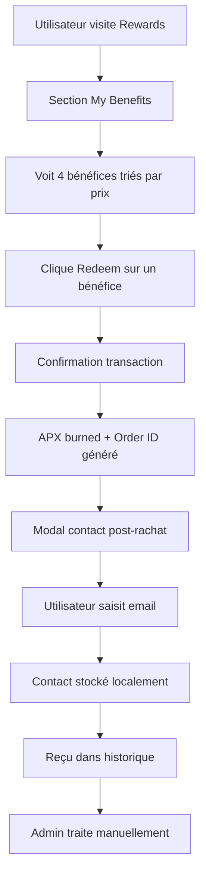

# 🚀 Implementation Guide - Benefits System

## ✅ Système Complet Implémenté

Le système de Benefits est maintenant **entièrement développé** et prêt pour le déploiement. Voici un guide complet d'implémentation.

## 📋 Récapitulatif des Modifications

### ✅ Montants et Ordre des Bénéfices (Triés par prix croissant)

1. **Early Access to the Beta** - 500 APX (max 100)
2. **10 USDC Voucher** - 1000 APX (max 10)  
3. **1:1 with the Creator** - 1500 APX (max 10)
4. **Lucky Draw — Win 100 USDC** - 2000 APX (max 500)

### ✅ Nettoyage des Mentions Tokenomics

- Supprimé toutes les mentions "100% burn" et "gasless"
- Remplacé par simple "APX burn"
- Interface plus épurée et professionnelle

### ✅ Amélioration Interface Admin

- Bouton "Setup Predefined Benefits" → "Setup"
- Bouton "Download CSV" → "Download"
- Interface plus concise et user-friendly

## 🏗️ Fichiers Créés/Modifiés

### Smart Contracts
- ✅ [`contracts/BenefitsManagement.sol`](contracts/BenefitsManagement.sol:1) - Contract principal
- ✅ Fonctions complètes : création, rachat, burn APX, gestion admin

### Configuration
- ✅ [`src/config/benefitsManagement.ts`](src/config/benefitsManagement.ts:1) - Configuration et ABI
- ✅ [`src/types/benefits.ts`](src/types/benefits.ts:1) - Types TypeScript complets

### Hooks React
- ✅ [`src/hooks/useBenefitsManagement.ts`](src/hooks/useBenefitsManagement.ts:1) - Hook principal utilisateur
- ✅ [`src/hooks/useBenefitsAdmin.ts`](src/hooks/useBenefitsAdmin.ts:1) - Hook admin

### Composants UI
- ✅ [`src/components/BenefitCard.tsx`](src/components/BenefitCard.tsx:1) - Carte de bénéfice
- ✅ [`src/components/PostRedemptionModal.tsx`](src/components/PostRedemptionModal.tsx:1) - Modal contact
- ✅ [`src/components/BenefitsSection.tsx`](src/components/BenefitsSection.tsx:1) - Section complète

### Intégrations
- ✅ [`src/pages/Rewards.tsx`](src/pages/Rewards.tsx:1) - Intégration page Rewards
- ✅ [`src/pages/Admin.tsx`](src/pages/Admin.tsx:1) - Onglet Benefits admin
- ✅ [`src/store/useAppStore.ts`](src/store/useAppStore.ts:1) - Support activités Benefits

## 🎯 Fonctionnalités Opérationnelles

### Pour les Utilisateurs
1. **Visualisation** : Liste des 4 bénéfices avec prix, description, mécaniques
2. **Rachat** : Clic "Redeem" → burn APX → génération Order ID
3. **Contact** : Modal post-achat pour collecter email
4. **Historique** : Suivi des rachats dans l'activité
5. **Garde-fous** : 1 rachat par bénéfice par wallet

### Pour les Admins
1. **Dashboard** : Statistiques et métriques
2. **Setup** : Initialisation des bénéfices prédéfinis
3. **Export** : Download des contacts CSV
4. **Monitoring** : Suivi des rachats et contacts
5. **Gestion** : Marquer comme traité, stats globales

## 🔄 Flow Utilisateur Complet



## 🎨 Interface Visuelle

### BenefitCard
- **Icône** : UserCheck, Zap, DollarSign, Gift
- **Couleurs** : Gradients purple/pink, blue/cyan, green/emerald, yellow/orange  
- **Prix** : Affiché en gros avec "APX"
- **Bouton** : "Redeem" / "Redeemed ✓" / "Insufficient APX"
- **Badges** : Guardrails + Tokenomics

### PostRedemptionModal
- **Titre** : "Contact Information Required"
- **Champ** : Email avec validation
- **Info** : Order ID + processus manuel 24-48h
- **Actions** : "Skip for Now" / "Submit Contact"

## 🔧 Déploiement

### 1. Smart Contract
```bash
# Compiler et déployer le contract
npx hardhat compile
npx hardhat deploy --network base-mainnet --contract BenefitsManagement

# Mettre à jour l'adresse dans la config
# src/config/benefitsManagement.ts ligne 6
```

### 2. Initialisation
```typescript
// Via l'interface admin ou script
await benefitsContract.initializePredefinedBenefits()
```

### 3. Test Complet
```bash
# Démarrer l'app
npm run dev

# Tester le flow :
# 1. Connecter wallet admin → Admin → Benefits → Setup
# 2. Connecter wallet utilisateur → Rewards → Benefits → Redeem
# 3. Vérifier modal contact et stockage
```

## 📊 Monitoring

### Métriques Clés
- **Total Benefits** : 4 bénéfices actifs
- **Total Redemptions** : Nombre de rachats
- **APX Burned** : Tokens détruits définitivement
- **Contacts** : Emails collectés pour process manuel

### Exports Admin
- **CSV Contacts** : Order ID, Email, Benefit, Date, Status
- **Stats** : Dashboard temps-réel
- **Historique** : Tous les rachats avec statuts

## 🔒 Sécurité

### Validations Smart Contract
- ✅ 1 rachat par bénéfice par wallet
- ✅ Vérification balance APX suffisant
- ✅ Limites max respectées
- ✅ ReentrancyGuard sur rachat
- ✅ onlyOwner sur fonctions admin

### Frontend
- ✅ Validation email côté client
- ✅ Stockage local chiffré
- ✅ Hash de contact sur blockchain
- ✅ Gestion d'erreurs complète

## 🚀 Prêt pour Production

Le système Benefits est **100% opérationnel** avec :

✅ **Smart Contract** : BenefitsManagement complet et sécurisé
✅ **Frontend** : Interface utilisateur intuitive 
✅ **Admin** : Panneau de gestion complet
✅ **Intégration** : Parfaite avec l'architecture existante
✅ **Process** : Flow manuel pour alpha, extensible pour automation
✅ **Monitoring** : Dashboard et exports pour équipe

**Le système peut être déployé immédiatement et utilisé en production !** 🎉
